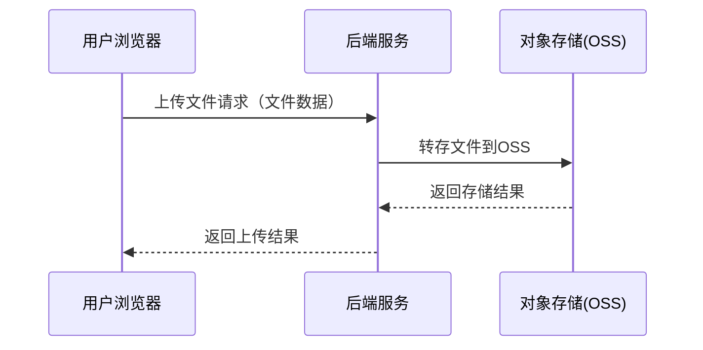
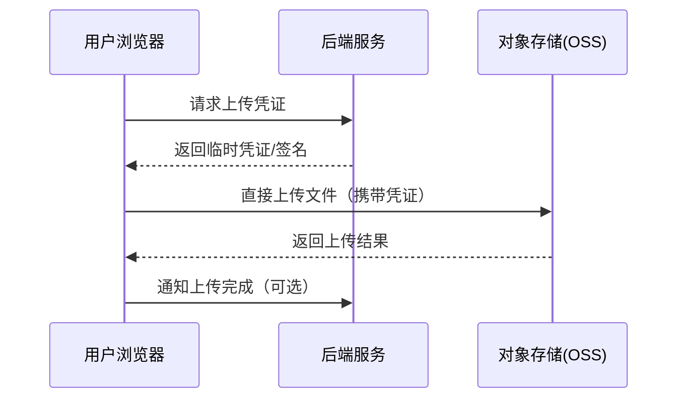

### 常见方式

用户在浏览器选择文件并上传，后端服务接收文件后进行处理，再将文件转存到对象存储（如OSS），最后将结果返回给用户，对预算低的业务雪上加霜，但是相较于前端通过 AK/SK 直连避免了密钥的泄漏。

**优点：**

- 安全性高，便于权限校验和内容检查
- 后端可灵活处理文件
- 用户无需关心存储细节

**缺点：**

- 后端带宽和资源压力大
- 上传速度受限于后端
- 系统架构更复杂
- 费用高，服务器与对象存储双重流量费用



## 推荐方式

- 如果追求高性能、低延迟、低成本，建议采用前端直传+后端签名的架构。

1. 用户浏览器向后端服务请求上传凭证（预签名上传 Url）。
2. 后端服务生成凭证并返回给用户浏览器。
3. 用户浏览器携带凭证，直接将文件上传到对象存储（OSS）。
4. 对象存储返回上传结果给用户浏览器。
5. 用户浏览器可选择通知后端服务上传已完成（或者通过Webhook），便于后端做后续处理或记录。

**优点：**

- 大幅减轻后端带宽和资源压力
- 上传速度快，充分利用对象存储带宽
- 仍可保证安全和权限控制

**缺点：**

- 前端实现稍复杂，需要处理凭证和直传逻辑
- 后端需设计凭证生成和校验机制
- 上传完成后的业务通知和一致性需额外处理



### Python 预先签名示例

::: warn
文件上传完成后 Url 在有限期内一直有效，用户能覆写该文件。
:::

```python
from datetime import timedelta

import minio

client = minio.Minio(endpoint='minio:9000', access_key='ak', secret_key='sk')

# 生成一个预签名的 PUT 请求 URL，并且要求 object key 为 'test.txt'，有效期为 2 分钟
client.presigned_put_object(bucket_name='docs', object_name='test.txt', expires=timedelta(minutes=2))
```

