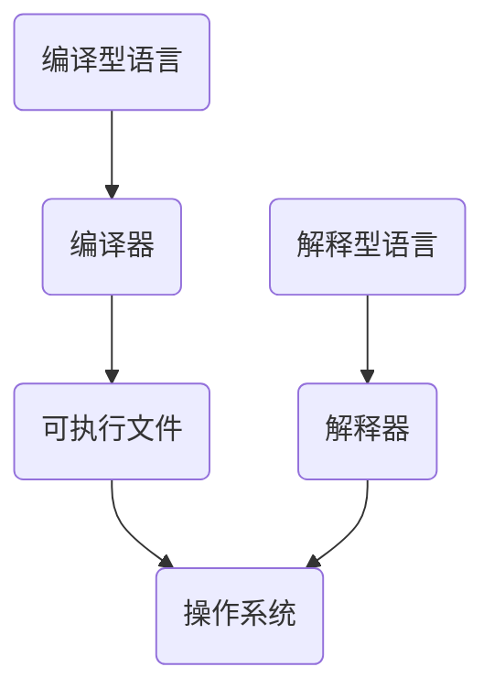
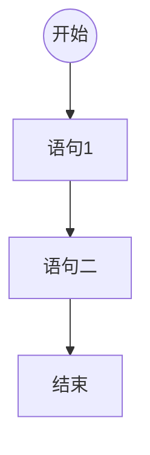
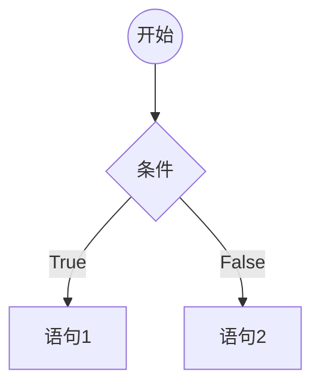
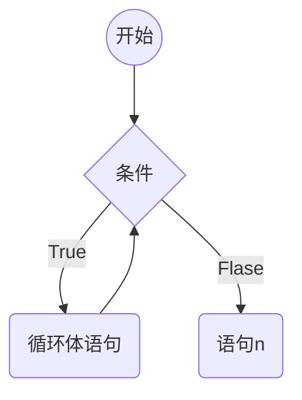
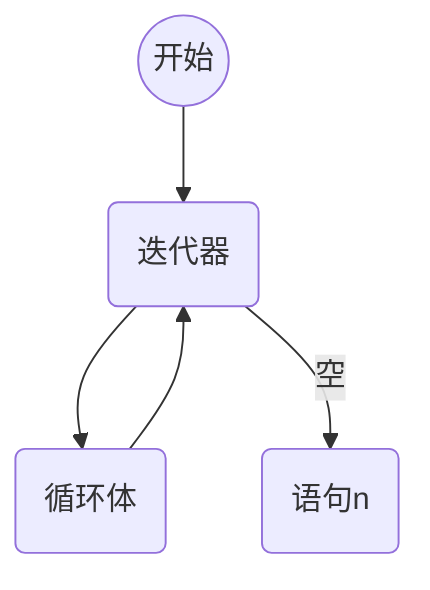
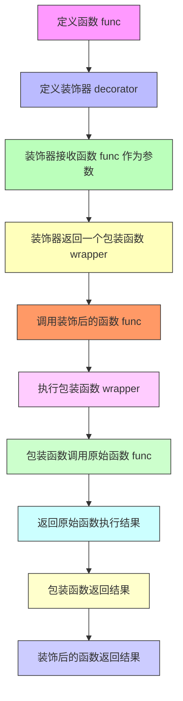
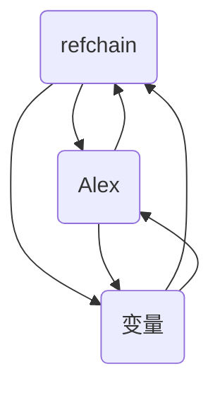
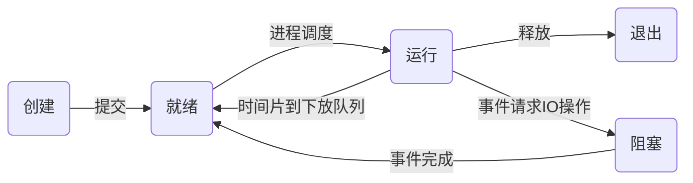

## 初始Python

### 编程语言分类



#### 编译型语言的优缺点

> 1. 一次性编译成平台相关的机器语言,运行时脱离开发环境,运行效率高;
> 2. 与特定平台相关,一般无法移植到其它平台(C、C++、GO)

#### 解释型语言

> 1. 解释型语言每次运行都需要将源码解释为机器码,执行效率低;
> 2. 只需要平台提供对应的解释器,就可以运行源码,易移植

> Cython, Jython, PyPy
>
> Cpython

## Python入门

### 环境管理


笔者在最开始学校中时，使用的是直接使用 Python 安装包安装，但是后来随着实践会发现很多三方库模块依赖于特定版本，例如 Python 3.9 全面放弃了对 Window 7 的支持。可能有人会想到同时安装多个 Python 版本不就能解决这个问题，这样确实可以解决问题，但是环境变量的管理就是灾难，你每次使用都需要确定自己是否使用对了，否则会出现你安装模块，结果安装到其它版本中，所以目前我推荐的组合是：

**conda 与 poetry 组合**

[Anaconda](https://www.anaconda.com/download)数据科学工具包(内置了1500+发行库)，[Miniconda](https://docs.conda.io/projects/miniconda/en/latest/)提供基础解释器与conda环境

Poetry 在此作为项目管理方案，更多可以前往 [Poetry](../Python-yun-poetry) 查看

**uv**

使用 Rust 语言构建，带来更快的速度和性能，同时具备 Python 版本管理和项目管理，所以可以单独使用，更多前往 [uv](../Python-yun-uv) 查看

### 换行符

```python
print(1)
print(2)
print(3);print(4)
```

### 注释

```python
# 打印1
print(1)

def add(a, b):
    """
    文档注释: 两数相加(常见于类或函数体注释)
    :param a: 数字1
    :param b: 数字2
    :return: 相加之和
    """
    return a+b
```

### 编码规范(PEP8)

PEP8是Python的官方代码风格指南，旨在提供一致、易于阅读和易于维护的Python代码。PEP 8规范包括以下方面:

> 1. 缩进:使用四个空格表示缩进
> 2. 行长:每行代码不应超过79个字符
> 3. 命名规范:变量名应以小写字母开头，使用下划线分隔多个单词;类名应
>    以大写字母开头，使用驼峰命名法。
> 4. 空格:在运算符两侧、逗号后以及冒号后应添加空格
> 5. 注释:注释应该清晰、简洁，使用英文书写。注释应该说明代码的作用而不是如何实现。
> 6. 函数和类:函数和类之间应该用两个空行分隔。
> 7. 导入:每个导入应该单独成行，避免使用通配符导入
> 8. 括号:在函数调用和定义中，括号内部应该没有空格。

除此之外，PEP 8还涵盖了代码布局、字符串引号、空行、文件编码等方面的规范。
遵守PEP 8规范可以增加代码的可读性和可维护性，这对于团队开发、代码重构和代码维护都非常有帮助。建议Python开发者遵守这些规则，以便与其他Python开发者协作，并使代码更易于理解和维护

### 变量

#### 定义变量

`a = 1`

#### 修改变量

```python
my_value = 1
my_value = 2
```

### 变量类型

#### 整形

不可变类型

```python
x = 10
```

#### 浮点型

不可变类型

```python
y = 0.56
z = .23
```


#### 字符串

有序的字符集合,存储文本信息，不可变类型

```python
a = '1'
print(type(a))
```

> 转义符
>
> 1. `\'`单引号
> 2. `\"`双引号
> 3. `\\`反斜杠
> 4. `\n`换行
> 5. `\t`制表符
> 6. `\r`回车符

> 格式化输出
>
> ```python
> print('你好,我是%s, 今年%d数, 身高%.2f' % ('李华', 18, 1.68))
> print(f'你好{18}')
> print('你好{}'.format(18))
> ```

#### 布尔型

```python
a = True
b = False
print(type(a), type(b))
```

#### 列表

可变类型

`a = []`

#### 字典

可变类型

`a = {}`

#### 元组

不可变类型

`a = ()`

#### 集合

可变类型

`a = {}`


### 输入输出

```python
print(1)
a = input('输入一个值')
```

### 运算符

```python
1+1
1-1
1*1
1/1
1%1
True and False
True or False
not True
True in [True, False]
```


## Python流程控制语句

### 顺序语句



```python
print(1)
print(2)
```


### 分支语句



```python
a = input("输入一个数字") 
if a == '1':
    # 语句1
    print('你输入了1')
else:
    # 语句2
    print('你输入的不是1')
```


### 循环语句(while)



```python
a = 0
while a < 10:	# 条件
    # 循环体
    a = a + 1
# 语句n
print(a)
```

### 循环语句(for)



```python
a = 0
for i in range(10): # range()迭代器
    # 循环体
    print(i)
    a = a + i
# 语句n
print(a)
```

### 循环退出机制

```python
a = 0
while True:
    a += 1
    if a > 100:
        # 退出上级循环
        break
    elif a > 10:
        # 退出上级 本次 循环
        continue
    a += 2
```

## 函数编程

函数是指将一组语句的集合通过一个名字（函数名）封装起来，要想执行这个函数，只需要调用函数名即可。

Python 中函数通过 `def` 关键词定义 后面跟上函数名和参数，Python 中的函数也是一个对象 `Code Object`

### 使用 def 关键词定义

```python
def greet(name):
    print(f"Hello, {name}!")
```

### 支持默认参数

```python
def greet(name="World"):
    print(f"Hello, {name}!")

greet()          # Hello, World
greet("Alice")   # Hello, Alice
```

### 支持可变参数（*args 和 **kwargs）

**位置参数不定数量：\*args**

```python
def sum_all(*args):
    return sum(args)

sum_all(1, 2, 3, 4)  # 10
```

**关键字参数不定数量：\*kwargs**

```python
def print_info(**kwargs):
    for key, value in kwargs.items():
        print(f"{key} = {value}")

print_info(name="Alice", age=25)
```

**一起使用**

```python
def sum_all(*args, **kwargs):
    return sum(args)

sum_all(1, 2, 3, 4)  # 10
```

### **函数也是对象，可以赋值、传参、返回**

```python
def add(x, y):
    return x + y

f = add
print(f(3, 4))  # 7
```

### **支持返回多个值（实际上是返回元组）**

```python
def get_point():
    return 1, 2

x, y = get_point()  # 解包
```

### **函数可以作为参数传递（函数是一等对象）**

```python
def apply(func, x, y):
    return func(x, y)

print(apply(add, 2, 3))  # 5
```

### 支持匿名函数（ lambda表达式 ）

```python
add = lambda x, y: x + y
print(add(3, 5))  # 8
```

### 限定符

#### 位置参数限定符（Positional-only）

- `/` 左边的参数：只能使用位置传递
- `/` 右边的参数：可以位置也可以关键字传递

```python
def func(a, b, /, c, d):
    print(a, b, c, d)
    
    
func(1, 2, 3, 4)        ✅ 正确
func(1, 2, c=3, d=4)    ✅ 正确
func(a=1, b=2, c=3, d=4) ❌ 报错（a、b 不能用关键字传参）
```

#### 关键字参数限定符（Keyword-only）

- `*` 后的参数：**只能用关键字方式传递**

```python
def func(a, b, *, c, d):
    print(a, b, c, d)
    
    
func(1, 2, c=3, d=4)    ✅ 正确
func(1, 2, 3, 4)        ❌ 报错（c、d 必须用关键字传递）
```

#### * 与 / 的混用（Python 3.8+）

- a, b: 只能位置传参
- c: 位置或关键字都可以
- d, e: 只能关键字传参

```python
def func(a, b, /, c, *, d, e):
    print(a, b, c, d, e)
    
func(1, 2, 3, d=4, e=5)    ✅
func(1, 2, c=3, d=4, e=5)  ✅
func(a=1, b=2, c=3, d=4, e=5) ❌ 报错
```

#### * 与 / 的作用及原因

1. **让函数接口更清晰**
   - 避免用户误用关键字或位置参数。
2. **保持向后兼容**
   - 如果以后函数参数名发生变化，位置传参不会受到影响。
3. **与 C 语言绑定接口兼容**
   - 比如 math.pow(x, y) 就不能用关键字传参。


### 闭包（Closure）

**一个函数返回了另一个函数**，而这个被返回的函数**引用了外部函数作用域中的变量**，即使外部函数已经执行完毕，**这些变量依然被“记住”

**闭包的关键要素**

1. 有**嵌套函数**（函数中定义函数）；
2. 内层函数引用了外层函数的**局部变量**；
3. 外层函数返回了内层函数。

```python
def make_multiplier(factor):
    def multiply(x):
        return x * factor  # 引用了外部变量 factor
    return multiply  # 返回内层函数

# 使用闭包创建两个函数
double = make_multiplier(2)
triple = make_multiplier(3)

print(double(5))  # 输出：10 （5 * 2）
print(triple(5))  # 输出：15 （5 * 3）
```


## 面向对象编程

面向对象编程是一种**以对象为中心**的编程思想，强调**封装（Encapsulation）**、**继承（Inheritance）** 和 **多态（Polymorphism）**。在 Python 中，一切皆对象，OOP 是内建支持的一种编程范式。

### 类（Class）和对象（Object）

- **类（Class）** 是对象的模板
- **对象（Object）** 是类的实例

```python
class Dog:
    def __init__(self, name):  # 构造函数
        self.name = name

    def bark(self):
        print(f"{self.name} says: Woof!")

d = Dog("Buddy")
d.bark()  # 输出：Buddy says: Woof!
```

### 封装（Encapsulation）

将数据和行为绑定在一起，并隐藏实现细节。

```python
class Account:
    def __init__(self, balance):
        self.__balance = balance  # 私有属性

    def deposit(self, amount):
        self.__balance += amount

    def get_balance(self):
        return self.__balance

a = Account(100)
print(a.get_balance())  # 100
```

### 继承（Inheritance）

子类可以继承父类的属性和方法。自己有该属性和方法时用自己的，自己没有时采取用父类的，从父类的父类 一直到 type 身上还没有就会抛出异常

```python
class Animal:
    def speak(self):
        print("Animal sound")

class Cat(Animal):
    def speak(self):
        print("Meow")

c = Cat()
c.speak()  # Meow
```

### 多态（Polymorphism）

不同类的对象可以通过相同的接口调用不同的方法行为。

```python
def make_sound(animal):
    animal.speak()

make_sound(Cat())   # Meow
make_sound(Dog("Tom"))  # Tom says: Woof!
```

### 魔法方法（magic methods）

Python 中的 **魔法方法（magic methods）**，也称为 **dunder 方法（double underscore methods）**，是以 `__双下划线__` 包裹的方法，用于实现对象的各种内建行为（比如：加法、比较、属性访问等）。以下是 Python 中常见和常用的魔法方法，按用途分类列出：

------

#### 🧱 一、对象构造与销毁

| 方法名              | 作用                              |
| ------------------- | --------------------------------- |
| `__new__(cls, …)`   | 创建对象时调用（先于 `__init__`） |
| `__init__(self, …)` | 初始化对象时调用                  |
| `__del__(self)`     | 析构函数，对象销毁时调用          |

------

#### 🏦 二、字符串表示

| 方法名                          | 作用                            |
| ------------------------------- | ------------------------------- |
| `__str__(self)`                 | `str(obj)`、`print(obj)` 时调用 |
| `__repr__(self)`                | `repr(obj)`、解释器中显示时调用 |
| `__format__(self, format_spec)` | `format(obj)` 时调用            |
| `__bytes__(self)`               | `bytes(obj)` 时调用             |

------

#### 📊 三、数值运算相关

##### 常规运算符重载：

| 方法名         | 运算符 | 示例     |
| -------------- | ------ | -------- |
| `__add__`      | `+`    | `a + b`  |
| `__sub__`      | `-`    | `a - b`  |
| `__mul__`      | `*`    | `a * b`  |
| `__truediv__`  | `/`    | `a / b`  |
| `__floordiv__` | `//`   | `a // b` |
| `__mod__`      | `%`    | `a % b`  |
| `__pow__`      | `**`   | `a ** b` |
| `__matmul__`   | `@`    | `a @ b`  |

##### 反向运算符重载（右操作数调用）：

| 方法名              | 运算符 | 示例                   |
| ------------------- | ------ | ---------------------- |
| `__radd__`          | `+`    | `b + a`（当 b 不支持） |
| `__rsub__`          | `-`    | 同上                   |
| …（对应上面的反向） |        |                        |

##### 就地运算符重载：

| 方法名          | 运算符 | 示例     |
| --------------- | ------ | -------- |
| `__iadd__`      | `+=`   | `a += b` |
| `__isub__`      | `-=`   | `a -= b` |
| …（对应上面的） |        |          |

------

#### ⚖️ 四、比较运算符

| 方法名   | 运算符 | 示例     |
| -------- | ------ | -------- |
| `__eq__` | `==`   | `a == b` |
| `__ne__` | `!=`   | `a != b` |
| `__lt__` | `<`    | `a < b`  |
| `__le__` | `<=`   | `a <= b` |
| `__gt__` | `>`    | `a > b`  |
| `__ge__` | `>=`   | `a >= b` |

------

#### 📏 五、一元运算符

| 方法名       | 运算符  | 示例     |
| ------------ | ------- | -------- |
| `__neg__`    | `-`     | `-a`     |
| `__pos__`    | `+`     | `+a`     |
| `__abs__`    | `abs()` | `abs(a)` |
| `__invert__` | `~`     | `~a`     |

------

#### 📊 六、类型转换相关

| 方法名                                 | 作用                 |
| -------------------------------------- | -------------------- |
| `__int__(self)`                        | `int(obj)`           |
| `__float__(self)`                      | `float(obj)`         |
| `__bool__(self)`                       | `bool(obj)`          |
| `__complex__(self)`                    | `complex(obj)`       |
| `__index__(self)`                      | 用于索引和位运算场景 |
| `__round__(self)`                      | `round(obj)`         |
| `__trunc__` / `__floor__` / `__ceil__` | 用于 `math` 函数     |

------

#### 🧹 七、容器相关（模拟序列、字典、集合）

| 方法名          | 作用               |
| --------------- | ------------------ |
| `__len__(self)` | `len(obj)`         |
| `__getitem__`   | `obj[key]`         |
| `__setitem__`   | `obj[key] = value` |
| `__delitem__`   | `del obj[key]`     |
| `__contains__`  | `key in obj`       |
| `__iter__`      | 可迭代支持         |
| `__next__`      | 支持迭代器协议     |
| `__reversed__`  | `reversed(obj)`    |

------

#### 🛠 八、上下文管理器（with 语句）

| 方法名      | 作用               |
| ----------- | ------------------ |
| `__enter__` | 进入 `with` 语句体 |
| `__exit__`  | 离开 `with` 语句体 |

------

#### 🧠 九、属性访问控制

| 方法名             | 作用                                |
| ------------------ | ----------------------------------- |
| `__getattr__`      | 访问不存在的属性时调用              |
| `__getattribute__` | 访问任意属性时都会调用              |
| `__setattr__`      | 设置属性时调用（包括 `self.x = 1`） |
| `__delattr__`      | 删除属性时调用                      |
| `__dir__`          | 控制 `dir(obj)` 的结果              |

------

#### 🏷 十、描述符协议（高级属性控制）

| 方法名       | 作用           |
| ------------ | -------------- |
| `__get__`    | 获取属性时调用 |
| `__set__`    | 设置属性时调用 |
| `__delete__` | 删除属性时调用 |

------

#### 🧹 十一、类相关魔法方法

| 方法名              | 作用                            |
| ------------------- | ------------------------------- |
| `__class__`         | 对象所属的类                    |
| `__class_getitem__` | 支持泛型语法，如 `MyClass[int]` |
| `__instancecheck__` | 自定义 `isinstance()` 行为      |
| `__subclasscheck__` | 自定义 `issubclass()` 行为      |
| `__init_subclass__` | 子类定义时自动调用              |

------

#### 📦 十二、元类相关（高级用法）

| 方法名            | 作用                     |
| ----------------- | ------------------------ |
| `__call__`        | 实例对象被调用时触发     |
| `__prepare__`     | 控制类体定义时的命名空间 |
| `__mro_entries__` | 控制多继承 MRO 合并规则  |

------

#### 🌀 十三、异步编程相关魔法方法

| 方法名       | 作用                         |
| ------------ | ---------------------------- |
| `__await__`  | 支持 `await obj`             |
| `__aiter__`  | 支持异步迭代 `async for`     |
| `__anext__`  | 支持异步迭代器 `async for`   |
| `__aenter__` | 异步上下文 `async with` 进入 |
| `__aexit__`  | 异步上下文 `async with` 退出 |


```python
class MyClass():
    def __new__(cls, *args, **kwargs):
        # new方法执行与__init__之前,new方法不return时init方法不执行
        return object.__new__(cls)
        
    def __init__():
        # 类实例化时调用
        pass
    def _func1(self):
        # 不建议外部直接访问的函数方法
        pass
    def __func2(self):
        # 只允许在类内部调用的方法
        pass
    
    def __len__():
        # 当调用len时被调用
        return 1
    def __doc__():
        # 类的文档
        pass
    
    def __repr__():
        # 调用该对象时调用
        return 'func'
    
    def __str__():
        # 打印时调用
        return 'func'
      
    def __call__():
      	# 当调用MyCalss()()时触发，将实例当作方法调用
        return None
    
    def __del__():
        # 对象被删除或程序执行完毕时会触发的函数
        pass
    
```

## 元类

### 基于类创建对象

```python
class Foo(object):
	def __new__(cls, *args, **kwargs):
		return object.__new__(cls)
		
	def __init__(self, name):
		self.name = name
"""
根据类创建对象
	执行类的new方法,创建对象(空对象).[构造方法] {}
	执行类的init方法,初始化对象.[初始化方法] {name: "李华"}
"""
obj = Foo('李华')
```

> 对象是基于类创建的

### 类的创建

> 类默认是由`type`创建的

```python
# 传统方式
class Foo(object):
    v1 = 666
    
    def func(self):
        return 666

# 非传统方式
def do(self):
    return 123

Foo = type('Foo', (object,), {'v1':666, 'func': lambda self: 666, 'do': do})
```

> 元类用于指定类由谁创建, 默认为`type`

```python
# 默认
class Foo(object, metaclass=type):
    pass

# Foo类由MyType创建
class MyType(type):
    pass

class MyFoo(object, metaclass=MyType):
    pass
```

> 类的创建流程
>
> 1. 实例化时会调用类的元类的`__ceil__`方法
> 2. `__ceil__`方法执行`__new__`创建了类和`__init__`实例化了类

```python
class MyType(type):
    def __init__(self, *args, **kwargs):
        super().__init__(*args, **kwargs)

    def __new__(cls, *args, **kwargs):
        new_cls = super().__new__(cls, *args, **kwargs)
        return new_cls

    def __call__(self, *args, **kwargs):
        # 实例加括号时调用
        # 调用当前类的__new__方法去创建对象
        empty_object = self.__new__(self)
        # 调用当前类的__init__方法去实例化对象
        self.__init__(empty_object, *args, **kwargs)
        return empty_object


# 假设Foo是一个对象，由MyType创建
# Foo类其实是MyType的一个对象
# 那么Foo()其实就是MyType().__cell__()
class Foo(object, metaclass=MyType):
    pass


a = Foo()
print(a)
```

### 单例模式

- 方式一：模块导入
- 方式二：并发编程
- 方式三：基于元类的单例模式

```python
class MyType(type):

    def __init__(self, name, bases, attrs):
        super().__init__(name, bases, attrs)
        # 类只会创建一次，在第一次创建时在类里创建一个变量
        self.instance = None

    def __call__(self, *args, **kwargs):
        # 判断当前类是不是第一次创建，如果是则给instance赋值为当前类，下一次再实例化时就不会创建类
        if not self.instance:
            self.instance = self.__new__(self)
        self.__init__(self.instance, *args, **kwargs)
        return self.instance


class Foo(object, metaclass=MyType):
    pass


a = Foo()
b = Foo()
# 此时a和b指向同一个类的实例
print(a == b)

```

## 装饰器

Python装饰器（Decorator）是一种设计模式，用来在不修改原有函数代码的情况下，动态地给函数或方法添加额外功能。它本质上是一个函数，接受另一个函数作为参数，并返回一个新的函数，这个新函数通常会在调用原函数前后执行一些额外操作，从而扩展或修改原函数的行为。

简单来说，装饰器就是“包装”一个函数，使其功能得到增强或改变，而不需要直接修改函数本身的代码。

装饰器的主要特点和用途包括：

-  **增强函数功能**：比如添加日志记录、权限校验、缓存结果、性能计时等。
-  **代码复用和简洁**：通过装饰器，可以把通用功能抽离出来，避免在多个函数中重复写相同代码。
-  **语法简洁**：使用`@装饰器名`语法，直接在函数定义上方应用装饰器，代码清晰易读。

> 本节包含4个核心概念：函数装饰器、类装饰器、装饰函数的装饰器、装饰类的装饰器

### 原理

Python 中万物皆是对象，在编译器层面都会被转换为 Python Object，函数和类也不例外，而装饰器是一个 `@` 语法糖，配合 `Callable` 类型的对象实现的拓展。

### 常见的 Callable

```python
def my_decorator()
		...
  
class MyDecoratorClass:
  	...
    
lambda_my_decorator = lambda x: x
```

### 装饰器的工作机制



当我们的 `Callable` 对象调用只有一个参数且该参数是 `Callable` 时，即可认为该对象是支持装饰器语法

```python
def my_decorator(func)
		...
  
class MyDecoratorClass:
  	
    def __init__(self, func):
      	pass
    
lambda_my_decorator = lambda func: func
```

当我们使用 `@` 进行装饰的时候，其实就是将被装饰对象传递给用于装饰的对象作为唯一参数，当我们在这个时候调用 work 函数实际是执行了 `my_decorator(work)()`

```python
def my_decorator(func):
    ...


@my_decorator
def work():
    print(1)


# 执行被装饰的函数
work()
# 等效于work未被装饰时
my_decorator(work)()
```

到此装饰器的工作原理便叙述完了，以上便是对语法糖的介绍

### 应用

上面我们介绍了装饰器的工作机制，并在最后将其转为等效写法，但是上面的代码我们并未实现装饰器的内容，你会遇到 `TypeError: 'NoneType' object is not callable`，我们将通过示例实际展示装饰器内部应该如何编写与使用，这里的内容涉及到函数编程中的闭包，此处将不再提及为什么装饰器内部的函数能拿到参数

#### 普通装饰器

本处以记录运行时间装饰器为例：

- `timing_decorator`：接受一个唯一 `Callable` 所以可以用作装饰器
- `wrapper`：装饰器内部的定义的一个方法用于接受不定量的参数
- `result = func(*args, **kwargs)`：被装饰函数执行的地方
- `return result`：返回被执行函数的运行结果
- `return wrapper`：将 wrapper 函数作为返回值，这里的 wrapper 并没有执行

我们装饰了 `worker_function` 此时 `worker_function` 就是 `timing_decorator` 内部的 `wrapper` 函数，所以实际运行逻辑为:

- worker_function() 这里的是被装饰的工作函数
  - timing_decorator(worker_function) 装饰器的内部转换
    - worker_function() 未被装饰的工作函数

```python
import time

def timing_decorator(func):
    def wrapper(*args, **kwargs):
        start_time = time.time()
        result = func(*args, **kwargs)
        end_time = time.time()
        print(f"{func.__name__} 运行时间: {end_time - start_time:.6f} 秒")
        return result
    return wrapper

@timing_decorator
def worker_function():
    # 模拟一个耗时的任务
    time.sleep(2)
    print("工作完成")
    
# 此时 worker_function 会被装饰器包裹，所以 worker_function 实际为 timing_decorator 中定义的 wrapper
worker_function()

# 等效于没有装饰器的情况
# timing_wrapper = timing_decorator(worker_function)
# timing_wrapper()

# output
# 工作完成
# worker_function 运行时间: 2.005153 秒
```

::: warn 注意
出于安全考虑，你需要确保你的装饰器实现是合理的避免出现如下装饰器，该装饰器不需要调用就会运行 worker_function 这是一件很危险的事，请确保你是真的需要如此
:::

```python
import time

def timing_decorator(func):
    func()

@timing_decorator
def worker_function():
    # 模拟一个耗时的任务
    time.sleep(2)
    print("工作完成")

```

#### 参数装饰器

本处以异常重试装饰器为例，我们看到不同点在于，本应该接受函数的装饰器变到了内层原来 `warpper` 的位置，上文中提到，装饰器只能接受一个参数，且类型必须为 `Callable` 所以，依照规则 `retry_decorator` 不是一个装饰，但是由于内部的 `decorator` 符合装饰器的定义，且 `retry_decorator` 返回的是未执行的 `decorator` 所以当我们执行 `retry_decorator` 函数时返回的就是一个装饰器，所以此时装饰器变为了 `retry_decorator()` ，由于 `retry_decorator` 并不是装饰器本体，所以他可以携带任意参数

```python
def retry_decorator(max_retries=3, delay=2):
    def decorator(func):
        def wrapper(*args, **kwargs):
            retries = 0
            while retries < max_retries:
                try:
                    return func(*args, **kwargs)
                except Exception as e:
                    print(f"Error: {e}. Retrying {retries + 1}/{max_retries}...")
                    time.sleep(delay)
                    retries += 1
            print("Max retries reached. Function failed.")
        return wrapper
    return decorator

@retry_decorator(max_retries=5, delay=1)
def risky_function():
    # Simulating a function that might fail
    import random
    if random.choice([True, False]):
        raise ValueError("Simulated error")
    return "Function succeeded"


# 等效于未被装饰时的 retry_decorator(max_retries=5, delay=1)(risky_function)()
risky_function()
```

#### 类装饰器

面向对象编程中提到类的身上具有一些魔法方法，这也是为什么类可以作为装饰器的原因：`def __call__(self)`，原理与函数装饰器一致只是调用变成了 `TimingDecoratorClass(worker_function)` 实例化类，由于有 `__call__` 方法，所以类的实例可以作为 `Callable` 调用

```python
import time


class TimingDecoratorClass:

    def __init__(self, func):
        self.func = func

    def __call__(self, *args, **kwargs):
        start_time = time.time()
        result = self.func(*args, **kwargs)
        end_time = time.time()
        print(f"{self.func.__name__} 运行时间: {end_time - start_time:.6f} 秒")
        return result


@TimingDecoratorClass
def worker_function():
    # 模拟一个耗时的任务
    time.sleep(2)
    print("工作完成")

# 等效于为被装饰的 TimingDecoratorClass(worker_function)()
worker_function()
```

#### 参数类装饰器

原理就是类装饰器和函数装饰器的结合，不过多赘述

```python
 class RetryDecoratorClass:
    def __init__(self, max_retries=3, delay=2):
        self.max_retries = max_retries
        self.delay = delay

    def __call__(self, func):
        def wrapper(*args, **kwargs):
            retries = 0
            while retries < self.max_retries:
                try:
                    return func(*args, **kwargs)
                except Exception as e:
                    print(f"Error: {e}. Retrying {retries + 1}/{self.max_retries}...")
                    time.sleep(self.delay)
                    retries += 1
            print("Max retries reached. Function failed.")
            return None

        return wrapper
```

#### 装饰类的装饰器

类也是一个 `Callable` 对象，只是调用类的操作实际上是实例化一个类，通过装饰器我们可以做很多操作，例如此处的单例模式。更甚至参数注入，我们可以通过 `setattr(instances[cls], 'settings', {'config': 'default'})` 为实例添加一些属性和方法

```python
def singleton(cls):
    instances = {}

    def get_instance(*args, **kwargs):
        if cls not in instances:
            instances[cls] = cls(*args, **kwargs)
        return instances[cls]

    return get_instance

@singleton
class MyClass:
    def __init__(self, value):
        self.value = value

    def display(self):
        print(f"Value: {self.value}")
```

#### 装饰类的类装饰器

原理也不过多赘述，类装饰与装饰类装饰器的结合

```python
class Singleton:
    instances = {}

    def __init__(self, cls):
        self.cls = cls

    def __call__(self, *args, **kwargs):
        if self.cls not in self.instances:
            instance = self.cls(*args, **kwargs)
            instance.settings = lambda: print(instance.value)
            self.instances[self.cls] = instance
        return self.instances[self.cls]


@Singleton
class MyClass:
    def __init__(self, value):
        self.value = value

    def display(self):
        print(f"Value: {self.value}")


print(MyClass('value').settings())

```

### 常见的装饰器

| **装饰器**                                        | **是否带参数**             | **说明**                                             |
|------------------------------------------------|-----------------------|----------------------------------------------------|
| @functools.wraps(wrapped)                      | ✅ 必须带参数（函数）           | 用于自定义装饰器时保留原函数元信息                                  |
| @functools.lru_cache(maxsize=128, typed=False) | ✅ 可选参数                | 基于 LRU 策略的缓存装饰器（Python 3.2+）                       |
| @functools.cache                               | ❌ 无参数版本的 LRU 缓存（无限大小） | Python 3.9+                                        |
| @functools.total_ordering                      | ❌                     | 自动补全比较运算符（Python 2.7+/3.2+）                        |
| @functools.singledispatch                      | ❌                     | 单分派泛函数（基于第一个参数类型，Python 3.4+）                      |
| @functools.singledispatchmethod                | ❌                     | 类方法版本的 singledispatch（Python 3.8+）                 |
| @functools.cached_property                     | ❌                     | 缓存属性值（Python 3.8+）                                 |
| @staticmethod                                  | ❌                     | 定义静态方法，无需 self                                     |
| @classmethod                                   | ❌                     | 定义类方法，第一个参数是 cls                                   |
| @property                                      | ❌                     | 将方法变为只读属性，常用于封装                                    |
| @typing.overload                               | ❌                     | 类型提示用函数重载装饰器（typing 中，Python 3.5+），用于类型检查工具，不影响运行时 |
| @typing.final                                  | ❌                     | 标记类或方法为不可重写（typing 中，Python 3.8+）                  |
| @functools.cache_property                      | ❌                     | Python 3.12 新增，线程安全的属性缓存装饰器                        |
| @abc.abstractmethod                            | ❌                     | 抽象方法定义（需配合 abc.ABC 类使用，Python 3.0+）                |
| @abc.abstractclassmethod                       | ❌                     | ✅ **已弃用**，请使用 @classmethod + @abc.abstractmethod   |
| @abc.abstractstaticmethod                      | ❌                     | ✅ **已弃用**，请使用 @staticmethod + @abc.abstractmethod  |
| @abc.abstractproperty                          | ❌                     | ✅ **已弃用**，请使用 @property + @abc.abstractmethod      |

#### wraps

原理的时候我们提到装饰器返回了一个可执行的对象，导致我们的的 `__name__`等原函数的信息变为了装饰器返回的函数的信息，所以通过该装饰器可以保留这些信息

#### cache 与 lru_cache

lru_cache 是 Python 的一个非常实用的**内置装饰器**，用于为函数结果提供 **最近最少使用（LRU）缓存**，可以显著提高函数的执行效率，尤其是当函数多次被调用且参数相同时。cache 是 `lru_cache(maxsize=None)` 的语法糖，maxsize 默认为 128 条

**共有方法**

| **方法名**           | **说明**                                                     |
| -------------------- | ------------------------------------------------------------ |
| 函数名.cache_clear() | 清空当前函数的所有缓存结果                                   |
| 函数名.cache_info()  | 返回缓存命中/未命中情况、缓存大小和最大容量（返回 CacheInfo 对象） |

#### total_ordering

自动补全类中的比较运算符方法（__lt__, __le__, __gt__, __ge__），只要你实现了其中的 一个（通常是 __lt__ 或 __gt__）加上 __eq__，Python 会自动帮你生成其他的比较方法。

```python
from functools import total_ordering

@total_ordering
class Person:
    def __init__(self, name, age):
        self.name = name
        self.age = age

    def __eq__(self, other):
        return self.age == other.age

    def __lt__(self, other):
        return self.age < other.age

# 使用示例
p1 = Person("Alice", 25)
p2 = Person("Bob", 30)

print(p1 < p2)   # True   => 使用 __lt__
print(p1 == p2)  # False  => 使用 __eq__
print(p1 <= p2)  # True   => 自动生成 __le__
print(p1 > p2)   # False  => 自动生成 __gt__
```

#### singledispatch

Python 提供的**单分派泛函数（single-dispatch generic function）机制，可以根据第一个参数的类型**来自动选择合适的函数处理逻辑。

```python
from functools import singledispatch

@singledispatch
def process(data):
    print("默认处理（兜底）:", data)

@process.register
def _(data: int):
    print("处理整数：", data)

@process.register
def _(data: str):
    print("处理字符串：", data)

@process.register
def _(data: list):
    print("处理列表：", data)


process(42)            # 输出：处理整数：42
process("hello")       # 输出：处理字符串：hello
process([1, 2, 3])      # 输出：处理列表：[1, 2, 3]
process(3.14)           # 输出：默认处理：3.14
```

**注意事项**

- 只能分派第一个参数的类型

- register 的参数类型必须写在**类型注解**中
- 装饰器默认函数是“兜底函数”
- process.registry 显示所有已注册类型与其对应的函数

#### cached_property

把方法的返回值缓存起来，**只计算一次**，后续访问时就像访问普通属性一样，**不会重复计算**。类似不带参数的缓存。

```python
from functools import cached_property

class Circle:
    def __init__(self, radius):
        self.radius = radius

    @cached_property
    def area(self):
        print("计算面积...")
        return 3.14 * self.radius ** 2

c = Circle(10)
print(c.area)  # 第一次访问：打印“计算面积...”，然后返回 314.0
print(c.area)  # 第二次访问：不再打印“计算面积...”，直接返回 314.0
```

#### overload

overload 是 Python 标准库 typing 中的一个装饰器，用于**函数类型提示的重载**，**只在类型检查阶段生效**，**不会影响运行时行为**。

```python
from typing import overload

@overload
def func(x: int) -> str:
    ...

@overload
def func(x: str) -> int:
    ...

def func(x):  # 实际的实现（只有一个）
    if isinstance(x, int):
        return str(x)
    elif isinstance(x, str):
        return len(x)
    else:
        raise TypeError("Unsupported type")
```

#### final

final 是 Python 3.8 引入的，用于标记类或方法为“不可被继承”或“不可被重写”，主要用于类型检查阶段，对运行时没有强制效果。

```python
from typing import final

class Base:
    @final
    def method(self):
        print("This method is final.")

class Sub(Base):
    def method(self):  # ❌ 静态检查器会报错
        print("Trying to override")


@final
class FinalClass:
    def greet(self):
        print("Hello")

class SubClass(FinalClass):  # ❌ 静态检查器会报错
    pass
```

#### cache_property

cached_property 是一个将方法变为**只计算一次**并**缓存结果**的属性的装饰器，常用于需要惰性计算但不希望每次访问都重新计算的属性。

```python
from functools import cached_property

class Circle:
    def __init__(self, radius):
        self.radius = radius

    @cached_property
    def area(self):
        print("Calculating area...")
        return 3.14159 * self.radius ** 2

c = Circle(10)
print(c.area)  # 第一次：计算并输出面积
print(c.area)  # 第二次：直接使用缓存值，不打印“Calculating area”
```

::: danger
不能用于 @staticmethod 或 @classmethod
:::

从 Python 3.12 开始，支持用 del 清除缓存 `del c.area` 清除缓存，下次访问会重新计算

## 迭代器

### 定义

**Iterable**

能够一次返回一个成员的对象。可迭代对象的示例包括所有序列类型（例如 [`list`](https://docs.python.org/3/library/stdtypes.html#list)、[`str`](https://docs.python.org/3/library/stdtypes.html#str) 和 [`tuple`](https://docs.python.org/3/library/stdtypes.html#tuple)）和一些非序列类型，例如 [`dict`](https://docs.python.org/3/library/stdtypes.html#dict)、 [文件对象 ](https://docs.python.org/3/glossary.html#term-file-object)，以及您使用 [`__iter__（）`](https://docs.python.org/3/reference/datamodel.html#object.__iter__) 方法或 [`__getitem__（）`](https://docs.python.org/3/reference/datamodel.html#object.__getitem__) 方法，实现[序列](https://docs.python.org/3/glossary.html#term-sequence)语义。

**Iterator**

表示数据流的对象。 重复调用迭代器的 [`__next__（）`](https://docs.python.org/3/library/stdtypes.html#iterator.__next__) 方法（或将其传递给内置函数 [`next（）`](https://docs.python.org/3/library/functions.html#next)）返回流中的连续项。当没有更多可用数据时，将引发 [`StopIteration`](https://docs.python.org/3/library/exceptions.html#StopIteration) 异常。 在此 point，迭代器对象将耗尽，并且对其的任何进一步调用 `__next__（）` 方法只需再次引发 [`StopIteration`](https://docs.python.org/3/library/exceptions.html#StopIteration) 即可。迭代器需要有一个返回迭代器的 [`__iter__（）`](https://docs.python.org/3/library/stdtypes.html#iterator.__iter__) 方法 对象本身，因此每个迭代器也是可迭代的，并且可以在大多数 接受其他可迭代对象的地方。 一个值得注意的例外是代码 尝试多次迭代传递。 容器对象（例如 [`列表 `](https://docs.python.org/3/library/stdtypes.html#list)）每次将迭代器传递给 [`iter（）`](https://docs.python.org/3/library/functions.html#iter) 函数或在 [`for`](https://docs.python.org/3/reference/compound_stmts.html#for) 循环中使用它。使用迭代器尝试此作只会返回上一个迭代传递中使用的相同耗尽的迭代器对象，使其看起来像一个空容器。

> 以上描述来自 Python 官方文档，我们可以理解为 Iterable 是数据的保存者，且它是一个可以无状态的，它不需要知道 Iterator 数到了第几个，但是 Iterable 需要能产生一个 Iterator；反之 Iterator 一定是有状态的，但是他并不需要保存数据。

从实现上看，一个 `Iterable` 要么具有 `__iter__` 方法，要么对象是一个序列（[sequence](https://docs.python.org/3/glossary.html#term-sequence)）且具有 `__getitem__` 方法，两个的作用其实都是为了保证在 `iter()` 函数的作用下能产生一个 `Iterator`。

而 `Iterator` 必须具有 `__next__` 方法，作用是为了保证在 `next()` 函数的作用下可以返回下一个 `Iterable` 中的值。

可以理解为如下代码中，在 `for` 循环工作前会将对象转为一个 `Iterator`，但是实际并不是如此，尽管 `iter_obj` 已经是一个 `Iterator`，但是在其内部还是会将其再转换一遍。

```python
lst = [1, 2, 3]

iter_obj = iter(lst)
for i in it:
    print(i)
```

### 实现

当我们自己实现一个迭代器或可迭代对象时，上面我们提到一个 `Iterator` 需要具备 `__next__` 函数来获取到下一个值，而 `Iterable` 需要具备 `__iter__` 来创造一个 `Iterator`，当我们在循环时 forin 内部将 Child 通过 `iter(Child)` 转为一个可迭代对象 ChildIter

```python
class ChildIter:
    def __init__(self, current):
        self.current = current

    def __next__(self):
        if self.current is None:
            raise StopIteration
        child, self.current = self.current, self.current.child
        return child


class Child:
    def __init__(self, name, child=None):
        self.name = name
        self.child = child

    def __iter__(self):
        return ChildIter(self)

child1 = Child("child1")
child2 = Child("child2", child1)
child3 = Child("child3", child2)

for cld in child2:
    print(cld.name)
```

### 迭代器的 iter

官方对 `Iterator` 的定义中提到，每个 `Iterator` 都需要实现 `__iter__` 方法，这样要求每一个 `Iterator` 也是一个 `Iterable`，如下代码中 ChildIter 是一个 `Iterator` 但是其不具备 `__iter__` 所以它不是一个 `Iterable`；当我在循环前手动的将其转为一个迭代器 `iter(child2)` 的时候会导致循环内部无法获取迭代器而抛出异常 `TypeError: 'ChildIter' object is not iterable`

```python
class ChildIter:
    def __init__(self, current):
        self.current = current

    def __next__(self):
        if self.current is None:
            raise StopIteration
        child, self.current = self.current, self.current.child
        return child


class Child:
    def __init__(self, name, child=None):
        self.name = name
        self.child = child

    def __iter__(self):
        return ChildIter(self)

child1 = Child("child1")
child2 = Child("child2", child1)
child3 = Child("child3", child2)

it = iter(child2)
next(it)

for cld in it:
    print(cld.name)
```

通常我们只需要为其补充上 `__iter__` 方法即可

```python
class ChildIter:
    def __init__(self, current):
        self.current = current

    def __next__(self):
        if self.current is None:
            raise StopIteration
        child, self.current = self.current, self.current.child
        return child

    def __iter__(self):
        return self
```

在开发中最好为其补充上 `__iter__` 方法，避免一些反直觉的错误出现，虽然：

**CPython 实现细节：**CPython 没有始终如一地应用迭代器定义 [`__iter__（）`](https://docs.python.org/3/library/stdtypes.html#iterator.__iter__) 的要求。另请注意，自由线程 CPython 不保证迭代器作的线程安全。

## 生成器

在 Python 中，使用了 **yield** 的函数被称为生成器（generator），实际上生成器上一种特殊的迭代器。

**yield** 是一个关键字，用于定义生成器函数，生成器函数是一种特殊的函数，可以在迭代过程中逐步产生值，而不是一次性返回所有结果。

如下代码中，生成器中有两个概念 生成器函数（gen） 与 生成器对象（g），当函数中使用了 `yield` 关键字时，Python 便不会将该函数当作一个普通函数来执行并返回结果，而是会返回一个生成器对象，只有当调用了 `next(g)` 时函数还会开始执行，当运行到 `yield` 时，将 num 当作返回值返回了出去，但是此时函数并没有执行完，生成器对象保存了一个**可暂停的帧（frame）**，与普通函数的区别在于：**帧对象不会立即销毁**，而是通过 yield 挂起并保存状态，直到下一次 next() 恢复。在生成器函数中不论有没有 `return` 值都会被当作 `StopIteration`

```python
def gen():
    for num in range(10):
        yield num

g = gen()

for i in g:
    print(i)
```

如果你需要获取 `return` 返回的值你需要手动处理 `StopIteration`

```python
def gen():
    for num in range(10):
        yield num
    return 100  # 返回值

g = gen()

while True:
    try:
        val = next(g)
        print(val)
    except StopIteration as e:
        print("返回值：", e.value)  # 获取 return 的值
        break
```

结合迭代器中我们的示例，改进版如下，将 `__iter__` 变成了一个生成器函数

```python
class Child:
    def __init__(self, name, child=None):
        self.name = name
        self.child = child

    def __iter__(self):
        child = self
        while child:
            yield child
            child = child.child

child1 = Child("child1")
child2 = Child("child2", child1)
child3 = Child("child3", child2)


for cld in child2:
    print(cld.name)
```

### 高级用法

生成器几乎和迭代器的功能一致，唯一不同的地方在于生成器具有 `send` 方法，可以为 `yield` 表达式赋值，其实 `next(g)` 相当于 `g.send(None)`，例如：

```python
def gen():
    total = 10
    while total > 0:
        value = yield total
        if value:
            total = value
        total -= 1


g = gen()
print(next(g))  # Output: 10
print(g.send(5)) # Output: 4
for i in g:
    print(i)  # Output: 3, 2, 1
```


## 垃圾回收机制

> 引用计数器为主
>
> 标记清除和分代回收未辅

### 引用计数器

#### 环状双向链表(refchain)

> 当前位置可以向上向下查找
>
> 在Python程序中创建的任何对象(不同类型存入的数据大不相同)都会放在refchain链表中




```python
# 不同类型创建的数据不同
# 内部会创建一些数据[上一个对象, 下一个对象, 类型, 引用个数(username应用就变为2)]
name = '李华' 
username = name
age = 18	# 内部会创建一些数据[上一个对象, 下一个对象, 类型, 引用个数, value]
hobby = ['篮球', '音乐']	# 内部会创建一些数据[上一个对象, 下一个对象, 类型, 引用个数, items, 长度]
```

> 在C源码中体现每个对象中都有相同的值:
>
> ​	PyObject结构体[上一个对象, 下一个对象, 类型, 引用个数]
>
> 多个元素组成的对象中:
>
> ​	PyObject(4个值) + ob_size


#### 类型封装的结构体

```python
'''
内部会创建:
	_ob_next = refchain上一个对象
	_ob_prev = refchain下一个对象
	ob_refcnt = 1
	ob_type = float
	ob_fval
'''
data = 3.14
```


#### 引用计数器

```python
v1 = 3,14
v2 = 999
v3 = (1, 2, 3)
```

> Python程序运行时,会根据数据类型的不同找到对应的结构体,根据结构体中的字段进行创建相关的数据,如何将对象添加到`refchain`双向链表中
>
> 在C源码中两个关键的结构体:PyObject、PyVarObject
>
> 每个对象中的ob_refcnt就是计数器，默认值为1，当有其它变量引用时，引用计数器就会发生变化

- 引用

```python
a = 999	# ob_refcnt = 1
b = a	# ob_refcnt = 2
```

- 删除引用

```python
a = 999	# a ob_refcnt + 1
b = a	# a ob_refcnt +1; b ob_refcnt -1
del b # b ob_refcnt -1
del a # a ob_refcnt -1
```

> 垃圾：当引用计数器为0时， 意味着没有人再去使用这个对象，这个对象就会被判定为垃圾
>
> 回收：1.将对象从`refchain`中移除 2.将对象销毁，内存归还

#### 循环引用&交叉感染

```python
v1 = [1, 2, 3] # v1: ob_refcnt = 1
v2 = [4, 5, 6] # v2: ob_refcnt = 1
v1.append(v2)	# v2: ob_refcnt = 2
v2.append(v1)	# v1: ob_refcnt = 1

del v1 # v1: ob_refcnt = 1
del v2 # v2: ob_refcnt = 1
# 此时v1，v2不可再用但是没有释放
```


### 标记清除

> 目的: 为了解决引用计数器循环引用的不足
>
> 实现: 在Python底层又维护了一个双向链表，表中存那些容易循环引用的对象（`list|dict|tupe|set`）
>
> 在Python内部__某种情况下__扫描__循环引用链表__的每个元素，检查是否存在循环引用，如果有则让双方的引用计数器`-1`如果为`0`则标记为垃圾回收

问题？

- 什么时候去扫描
- 链表扫描代价大，耗时久


### 分代回收

为了解决循环引用以及提高垃圾回收效率，Python引入了**分代回收**（Generational Garbage Collection）。分代回收的核心思想是：大多数对象都具有较短的生命周期，而少数对象会长期存在。因此，回收短生命周期的对象比回收长生命周期的对象更为频繁。

#### 分代回收的原理

Python的垃圾回收器将所有对象分为三个代：

- **第0代**：新创建的对象，生命周期通常较短。
- **第1代**：经过一次垃圾回收后仍然存活的对象。
- **第2代**：经过多次垃圾回收后仍然存活的对象，通常是长时间存在的对象。

分代回收的工作流程如下：

1. **第0代回收**：回收第0代对象，因为它们大多数是临时对象，生命周期较短，回收频率较高。
2. **第1代回收**：当第0代回收后，还有存活对象会晋升到第1代。第1代对象回收的频率较低。
3. **第2代回收**：第2代对象存活的时间最长，因此回收频率最低。通常只有当第0代和第1代的回收没有清除所有垃圾时，才会回收第2代对象。

#### 为什么分代回收有效

分代回收通过以下方式提高了垃圾回收的效率：

- **提高回收效率**：由于大部分对象都是短生命周期的，将它们集中在第0代并高频次回收，有效减少了回收时间。
- **减少回收频率**：长生命周期的对象不需要频繁检查。只有在需要的时候，才会进行回收，降低了不必要的性能开销。

#### 循环引用的处理

分代回收不仅优化了内存管理，还能够有效处理**循环引用**。垃圾回收器会定期扫描每一代中的对象，尤其关注那些形成循环引用的对象。如果它们不再被任何外部对象引用，回收器会将其标记为垃圾并清除，释放内存。

> 将可能存在循环引用的对象维护成3个链表:
>
> 每次扫描后不是垃圾的就会提升代数
>
> - 0代：0代中对象个数达到700个扫描一次
> - 1代：0代扫描10次，则1代扫描一次
> - 2代：1代扫描10次，则2代扫描一次

### Python的gc模块与手动控制

Python 提供了 `gc` 模块来帮助程序员更好地管理垃圾回收过程。通过 `gc` 模块，可以手动控制垃圾回收的执行时机，查看回收的统计信息，甚至调整垃圾回收的频率。

常用的 `gc` 模块方法包括：

- `gc.collect()`：手动触发垃圾回收。
- `gc.get_stats()`：获取垃圾回收的统计信息。
- `gc.set_debug()`：开启调试模式，输出详细的垃圾回收过程信息。

通过手动控制垃圾回收，程序员可以更精确地优化内存管理，避免频繁回收带来的性能问题。

### 弱引用：避免循环引用的另一种方式

除了垃圾回收器，Python还提供了**弱引用**（weakref）来帮助打破循环引用。弱引用允许对象被引用，但不会增加其引用计数。这样，当对象不再有强引用时，垃圾回收器可以自由回收这些对象，从而避免循环引用导致的内存泄漏。

例如：

```
import weakref

class A:
    def __init__(self):
        self.b = None

class B:
    def __init__(self):
        self.a = None

a = A()
b = B()
a.b = weakref.ref(b)  # 使用弱引用
b.a = a
```

在这个例子中，`a.b`是`b`的弱引用，即使`a`和`b`之间存在循环引用，垃圾回收器仍然可以回收这两个对象。

### 小结

> 在Python中维护了一个refchain的双向环状链表，这个链表中存储程序创建的所有对象，每种类型的对象中都有一个ob_refcnt的应用计数器值，被引用和删除是引用计数器的值会随之发生改变，最后当引用计数器的值为0时标记为垃圾进行垃圾回收（对象销毁，从refchain中移除）
>
> 但是，在Python中对于那些有多个元素组成的对象可能出现循环引用的问题，为了解决这个问题Python又引入了标记清除和分代回收，在其内部维护了四个双向环状链表，分别是：
>
> - refchain
> - 0代
> - 1代
> - 2代
>
> 当达到各自的阈值时就会触发扫描链表进行编辑清除动作（有循环引用则引用计数器-1）

### 缓存机制

#### 池(small_ints)(int)

> 为了避免重复的创建和销毁一些常见对象，维护池

```python
# 启动解释器时Python内部会帮我们创建一些常见对象： -5， -4， -3....256
v1 = 2	# 内部不会开辟内存，直接去池中获取
v2 = 3	# 内部不会开辟内存，直接去池中获取
v3 = 3
print(id(v2), id(v3))

v4 = 666	# 开辟内存创建对象
```


#### free_list（float/list/tuple/dict）

> 当一个对象引用计数器为0时，按理是应该回收，内部不会直接回收，而是将都对象添加到free_list链表中当缓存。
>
> 以后再去创建时就不会重新开辟新的内存，而是直接使用free_list中的对象
>
> tuple上限为20，会根据袁术的个数找到对应的上线index存入其中

```python
v1 = 3.14	# 开辟内存，内部存储结构体中定义那几个值，并存入refchain中

del v1	# refchain中移除，将对象添加到free_list中（有上限80个），free_list满了才会进行销毁

v2 = 99.9	# 直接去free_list中获取
```

## 并发编程

> 通过代码编程使计算机在一定时间内能同时运行多个程序的编程操作，实现让CPU执行多任务，__并发编程的目的是充分利用CPU，以达到最高的处理性能__
>
> 多任务的实现方式：
>
> - 进程：操作系统资源分配和运行的最小单位
> - 线程：进程内的一个任务执行独立单元，是任务调度和系统执行的最小单位
> - 协程：用户态的轻量级线程，协程调度弯曲由用户控制，重要为了单线程下模拟多线程
>
> 一个程序可以拥有多个进程，每个进程可以用有多个线程，每个线程下可以有多个协程


### 进程

> 组成：
>
> - 程序段：指令集，进程运行的代码段
> - 数据集：数据段，进程执行中向操作系统申请分配的所需要使用的资源
> - 控制块：程序控制块（Program Control Block,，简称PCB），用于记录进程的外部特征，描述进程的执行变化过程，存在系统可以利用它来控制和管理进程，是操作系统感知进程存在的唯一标识
>

#### 进程的标记

> 区分进程的唯一标识PID（Process Identification）
>
> `os.getpid() # 获取当前进程的PID`
>
> `os.getppid() # 获取当前进程的父级的PID`


#### 进程调度

> FCFS调度算法：先到先服务
>
> SJF/SPF调度算法：短作业（短进程调度算法）
>
> PR调度算法：时间片轮转调度算法
>
> MFQ调度算法：多级反馈队列调度算法（目前被公认最优）


#### 并行、并发和串行

> 并行（Parallel），是指多个任务作业在同一时间内分别在各个CPU下执行（多核CPU下才会存在）
>
> 并发（Concurrent），是指在资源有限（单核CPU）的情况下，系统调度只能在同一时间执行一个任务，CPU的控制权在多个任务质检快速的来回切换，因为CPU切换的熟读非常快，使用会造成看起来是同时执行了多个任务的效果。并发在单核CPU和多核CPU都可以存在，看起来是并行，实际是串行
>
> 串行（Serial），是指多个任务在同一时间呢哦CPU只能执行一个任务的作业，第一个执行完之后才会执行第二个


#### 进程的状态

> 在实际开发过程中，往往任务作业的数量远高于CPU核心数，所以程序运行的过程中，由于被操作系统的调度算法控制，程序会静茹以下几个状态：
>
> - 就绪（Ready）：当进程已经分配到除CPU外的所有必要资源，只需要会的处理的机会便可立即执行
> - 运行（Running）：当进程已获得CPU资源，程序正在CPU上执行
> - 堵塞（Blocked）：正在执行的进程，由于某个IO事件（网络请求、文件读写、input、sleep等）发生而无法执行时，便放弃对某个CPU资源的占用并进入到阻塞状态



#### 同步与异步、阻塞与非阻塞

> 同步和异步是个对人物处理过程的方式与手段，而阻塞和非阻塞是多个任务处理过程中的某个任务的__等待状态__（往往是因为IO操作带来的阻塞）

| 概念                  | 描述                                                         |
| --------------------- | ------------------------------------------------------------ |
| 同步（Synchronous）   | 任务按照顺序执行上一个产生结果才会到下一个                   |
| 异步（Asynchronous）  | 执行上一个任务时上一个任务进入了等待状态后就切换执行下一个任务，当上一个任务等待转台消失则切换回上一个任务执行后续操作（多个任务可以来回切换，交替运行） |
| 阻塞（Blocking）      | 执行A任务时进入了等待（挂起）状态，在这个状态下CPU不能执行其他的任务操作 |
| 非阻塞（Nonblocking） | 执行A任务时进入等待（挂起）状态，在这个状态下CPU可以执行其它的任务操作 |

> 同步与异步和阻塞与非阻塞还可以产生不同的组合：
>
> - 同步阻塞形式
>
>   就是执行多个任务时，一个接着一个的执行，如果A任务处于阻塞状态，CPU会进行等待，不能进行其它操作
>
>   ```python
>   import time
>
> 
>
>     def taskRun(fun):
>       def task():
>           print(f'{fun.name}开始运行')
>           v = fun()
>           print(f'{fun.name}运行结束')
>           return v
>       return task
>                                                                                                                                                                               
>      @taskRun
>       def taskA():
>           time.sleep(5)
>                                                                                                                                                                             
>       @taskRun
>       def taskB():
>           time.sleep(8)
>                                                                                                                                                                             
>       taskA()
>       taskB()
>     
>
>  
>
> - 异步阻塞形式
>
>   就是执行多个任务时，多个任务可以交替运行，但任意一个任务处于阻塞状态时CPU会进行等待，不能进行其它操作，如果没有任务阻塞那么CPU就会交替运行，因为有阻塞的情况的出现，所以无法发挥效果，看起来和同步没有区别
>
>   ```python
> import multiprocessing
> import time
> 
> 
> def taskA():
>   print(1)
>   time.sleep(0.1)
>   print(2)
> 
> 
> def taskB():
>   print(3)
>   time.sleep(0.1)
>   print(4)
> 
> 
> if __name__ == '__main__':
>   a = multiprocessing.Process(target=taskA)
>   b = multiprocessing.Process(target=taskB)
>   for process in [a, b]:
>       process.start() # 启动进程
>       process.join()  # 加上join形成异步阻塞
>   ```
>
> 
>
> - 同步非阻塞形式
>
>   执行多个任务时，一个接着一个的执行，如果A任务被阻塞，CPU则会切换到B任务操作，而B任务操作过程中不会进入阻塞状态，当B任务操作结束以后，CPU切回A任务接着执行，直到A任务结束，CPU接着执行其它任务
>
> 
>
> - 异步非阻塞形式
>
>   执行多个任务时，多个任务可以交替执行，当任意一个任务A处于阻塞状态，CPU就会切换到其他任务B操作中，当A任务的阻塞状态消失后，CPU接着交替执行多个任务，异步非阻塞是我们所追求的最完美形式


#### 进程的创建

- 使用`os.fork`创建

  ```python
  import os
  
  pid os.fork()
  ```


### 线程


### 协程


## 并发异步（Celery）

### 简介

> Celery是一个简单、灵活且可靠的，处理大量消息的分布式系统，专注于实时处理的异步任务队列，同时也支持任务调度。

### 使用场景

- 异步任务
- 定时任务

### 安装

`pip install celery`

### 创建任务

`celery_task.py`

```python
import celery
import time

backend = 'redis://127.0.0.1:6379/1'
broker = 'redis://127.0.0.1:6379/2'

cel = celery.Celery(namespace='test', backend=backend, broker=broker)

@cel.task		
def send_mail(name):
    print(f'向{name}发送邮件')
    time.sleep(5)
    print(f'向{name}发送邮件完成。。。')
return 'ok'
```


### 启动任务监听

`celery worker -A filename -l info`


### 使用异步任务

`produce_task.py`

```python
from celery_task import send_mail

result = send_mail.delay('yun')
# 返回值不是函数返回值，result.id用于去redis中取对应的数据
print(result.id)
```


### 获取结果

```python
from celery.result import AsyncResult
from celery_task import cel

async_result = AsyncResult(id='', app=cel)

if async_result.successful():
    # 获取执行结果
    result = async_result.get()
    # .forget() 将结果删除，执行完成，结果不会自动删除
    print(result)
elif async_result.failed():
    print('执行失败')
elif async_result.status == 'PENDING':
    print('任务执行中')
elif async_result.status == 'RETRY':
    print('任务异常正在重试')
elif async_result.status == 'STARTED':
    print('任务已经开始被执行')
```


### 多文件结构

```
task_cel
	celery_tasks
		__init__.py
		celery.py
		task1.py
		task2.py
		...
	check_result.py
	produce_task.py
```


```python
# celery.py
from celery import Celery

cel = Celery(
    'task_demo',
    backend='redis://127.0.0.1:6379/1',
    broker='redis://127.0.0.1:6379/2',
    # 帮助celery找到对应的task所在文件夹
    include=[
        'celery_tasks.task1',
        'celery_tasks.task2',
    ]
)

cel.conf.timezone = 'Asia/Shanghai'
cel.conf.enable_utc = False
# 开启work：celery task celery_tasks -l info -P eventle 
# -c 5 指定并发数
# 最新5版本启动命令 celery --app=celery_tasks worker -P eventlet -l INFO
```


### 定时任务


```python
from celery_task import send_mail
from datetime import datetime


# 方式一
v1 = datetime(2020, 2, 11, 16, 19, 24)
v2 = datetime.utcfromtimestamp(v1.timestamp())
result = send_mail.apply_async(args=['name',], eta=v2)
print(result.id)

# 方式二
ctime = datetime.now()
utc_ctime = datetime.utcfromtimestamp(ctime.timestamp())
from datetime import timedelta
time_delay = timedelta(seconds=10)
task_time = utc_ctime + time_delay
result = send_mail.apply_async(args=['name',], eta=task_time)
print(result.id)
```


### 多文件运行定时任务

```python
# celery.py
from celery import Celery


cel = Celery(
    'task_demo',
    backend='redis://127.0.0.1:6379/1',
    broker='redis://127.0.0.1:6379/2',
    # 帮助celery找到对应的task所在文件夹
    include=[
        'celery_tasks.task1',
        'celery_tasks.task2',
    ]
)

cel.conf.timezone = 'Asia/Shanghai'
cel.conf.enable_utc = False

from datetime import timedelta
from celery.schedules import crontab
cel.conf.beat_schedule = {
    'add-every-10-seconds': {
        'task': 'celery_tasks.task01.send_mail',
        # 每6秒执行一次
        'schedule': timedelta(seconds=6),
        # 每年4月11如8点42分执行
        # 'schedule':crontab(minute=42, hour=8, day_of_month=11, month_of_year=4)
        'args': ('云海', )
    }
}
# 开启work：celery beat -A celery_tasks -l info -P eventle
```

> 执行器关闭后未关闭触发器，那么就会在产生历史遗留任务，下次执行器启动时回自动执行历史任务（删除对应的数据就可以解决）


### Djnago集成

```
mycelery
	__init__.py
	config.py	# 用于把数据库配置写在这
	main.py
	sms	# 短信功能
		__init__.py
		tasks.py	# 必须叫tasks
```


```python
# config.py
result_backend = 'redis://:20020308@192.168.10.84:6379/0'  
# Broker配置，使用Redis作为消息中间件
broker_url = 'redis://:20020308@192.168.10.84:6379/1'
```


```python
# main.py
import os
from celery import Celery


app = Celery('django_celery')

# 把celery与django结合，识别加载django的配置文件
os.environ.setdefault('DJANGO_SETTINGS_MODULE', 'djangoProject.settings')

# 跳过app对象加载配置文件
app.config_from_object('mycelery.config')

# 加载任务
# 参数列表必须是一个列表， 里面每一个任务都是任务的路径名称
app.autodiscover_tasks(['mycelery.sms',])

# 启动Celery命令
# 建议切换到mycelery根目录下启动

# 定时 celery -A mycelery.main beat -l info
# 消费 celery -A mycelery.main worker --loglevel=info -P eventlet
```


```python
# django视图中使用

from django.shortcuts import HttpResponse
from myselery.sms.tasks import send_sms


def test(reqeust):
    # 异步任务
    send_sms.delay('phone')
    
    # 定时任务
    ctime = datetime.now()
	utc_ctime = datetime.utcfromtimestamp(ctime.timestamp())
	from datetime import timedelta
	time_delay = timedelta(seconds=10)
    task_time = utc_ctime + time_delay
    result = send_mail.apply_async(args=['name',], eta=task_time)
    return HttpResponse('ok')
```

> 如果执行器和django不在同一服务器，那么celery代码应该拷贝两份，一份用于调度，一份用于执行

### `Celery 5.0`各环境运行命令

在`windows`环境下需要依赖eventlet，没有 eventlet 会导致接收到任务但不会执行

`celery --app=YouAppName worker -P evenlet -l INFO`

`Linux`环境

`celery --app=YouAppName worker -l INFO`

`celery -A YouAppName worker -l INFO`


### Celery 命令行工具来检查任务状态

1. **查看所有等待的任务**：

bash

```bash
celery -A proj inspect active
```

1. **查看等待的任务（不包括正在执行的任务）**：

bash

```bash
celery -A proj inspect reserved
```

1. **查看所有任务的状态**：

bash

```bash
celery -A proj inspect scheduled
```

1. **查看特定任务的状态**：

bash

```bash
celery -A proj inspect task <task_id>
```

这里的 `-A proj` 指的是你的 Celery 应用的模块名。


## 协程&asyncio&异步编程

### 协程

> 协程不是计算机提供的，而是由程序员人为创建的微线程，是一种用户态内的上下文切换技术。简而言之，就是通过线程实现代码块的相互切换执行

实现协程的一些模块：

1. greenlet：早期模块

   `pip install greenlet`

   ```python
   from greenlet import greenlet
   
   
   def func1():
       print(1)
       gr2.switch()
       print(2)
       gr2.swithch()
   
   def fun2():
       print(3)
       gr1.switch()
       print(4)
       
       
   gr1 = greenlet(func1)
   gr2 = greenlet(func2)
   
   gr1.switch()
   ```

   

2. yield：关键字

   ```python
   def func1():
       yield 1
       yield from fun2()
       yield 2
       
   def func2():
       yield 3
       yield 4
       
   f1 = func1()
   for item in f1:
       print(item)
   ```

   

3. asycnio：装饰器（py3.4>）

   > 遇到IO自动切换

   ```python
   import asyncio
   
   @asyncio.coroutine
   def func1():
       print(1)
       yield from asyncio.sleep(2) # 遇到IO操作自动切换到tasks中的其它任务中
       print(2)
       
       
   @asyncio.coroutine
   def func2():
       print(3)
       yield from asyncio.sleep(4)
       print(4)
   
   
   tasks = [
       asyncio.ensure_future(func1()),
       asyncio.ensure_future(func2()),
   ]
   
   loop = asyncio.get_event_loop()
   # loop.run_until_complete(fun1())
   loop.run_until_complete(asyncio.wait(tasks))
   ```

   

4. async,await：关键字（py3.5>）【推荐】

   ```python
   import asyncio
   
   
   async def func1():
       print(1)
       await asyncio.sleep(2) # 遇到IO操作自动切换到tasks中的其它任务中
       print(2)
   
   
   async def func2():
       print(3)
       await asyncio.sleep(4)
       print(4)
   
   
   tasks = [
       asyncio.ensure_future(func1()),
       asyncio.ensure_future(func2()),
   ]
   
   loop = asyncio.get_event_loop()
   loop.run_until_complete(asyncio.wait(tasks))
   ```

### 意义

> 在一个线程中如果遇到IO等待的时间，线程不会傻傻的等，利用空闲时间再去干其他事

```python
import asyncio, aiohttp


async def getImage(session, url):
    print('发送请求')
    async with session.get(url) as response:
        content = await response.content.read()
        file_name = url.rsplit('_')[-1]
        with open(file_name, 'wb') as f:
            f.write(content)


async def main():
    async with aiohttp.ClientSession() as session:
        url_list = [
            'http://127.0.0.1/1_1.jpg',
            'http://127.0.0.1/2_1.jpg',
        ]
        tasks = [asyncio.create_task(getImage(session, i)) for i in url_list]
        await asyncio.wait(tasks)
        
if __name__ == '__main__':
    asyncio.run(main())
```


### 异步编程

#### 事件循环

> 理解为死循环，去检测并执行某些代码

```python
import asyncio

# 获取事件循环
loop = asyncuo.get_event_loop()

# 将任务放到任务列表
loop.run_until_complete(asyncio.wait(tasks))
```


### 快速上手

> 协程函数，定义函数时`async def funcname`
>
> 协程对象，协程函数()得到协程对象
>
> ```python
> async def func():
>     pass
> 
> result = func()
> ```
>
> 注意：执行协程函数创建协程对象，函数内部代码不会执行

```python
async def func():
    print(1)

result = func()
# 3.5>
loop = asyncuo.get_event_loop()
loop.run_until_complete(result)
# 3.7>
asyncai.run(result)
```


### await关键词

> await+可等待对象（协程对象、Future、Task对象）（IO等待）

```python
import asyncio


async def func():
    print(11111111)
    # 上一个执行完成执行下一个
    response1 = await func2()
    response2 = await func2()
    print('结束', response1, response2)
    return '返回'

async def func2():
    print(222222)
    response = await asyncio.sleep(4)
    print('执行')
    

asyncio.run(func())
```

### task对象

> 在事件循环中添加多个任务
>
> Tasks用于并发调度协程，通过`asyncio.create_task(协程对象)`(3.7>=)的方式创建Task对象，这样可以让协程加入事件循环中等待被调度执行。除了使用这个以外还可以使用低层级的`loop.create_task()`或`asyncio.ensure_future()`(3.7<)函数。不建议手动实例化Task对象

```python
import asyncio


async def func1():
    print(1)
    await asyncio.sleep(5)
    print(2)
    return '111'

async def main():
    # 创建Task对象
    tasks1 = asyncio.create_task(func1())
    tasks2 = asyncio.create_task(func1())

    ret1 = await tasks1
    ret2 = await tasks2
    print(ret1, ret2)

asyncio.run(main())
```

```python
import asyncio


async def func1():
    print(1)
    await asyncio.sleep(5)
    print(2)
    return '111'

async def main():
    tasks = [
        # 设置名称，在最后返回时的标识，此处要创建task，3.8提议，3.11删除
        asyncio.create_task(func1(), name='a1'),
        asyncio.create_task(func1(), name='a2')
    ]
    # timeout 最多等多久
    done, pending = await asyncio.wait(tasks, timeout=10)
    print(done, pending)

asyncio.run(main())
```

```python
import asyncio


async def func1():
    print(1)
    await asyncio.sleep(5)
    print(2)
    return '111'


# 此时没有事件循环不能创建task对象
tasks = [
    func1(),
    func1(),
]
done, pending = asyncio.run(asyncio.wait(tasks))
```


### asyncio.Future对象

> Task继承Future，Task对象内部await结果的处理基于Future对象

```python
import asyncio


async def main():
    # 获取当前事件循环
    loop = asyncio.get_running_loop()

    # 创建一个任务（Future对象），这个任务什么都不干
    fut = loop.create_future()

    # 等待任务最终结果（Future对象），没有结果则会一直等下去
    await fut

asyncio.run(main())
```


```python
import asyncio

async def func(fut):
    await asyncio.sleep(2)
    fut.set_result('666')

async def main():
    # 获取当前事件循环
    loop = asyncio.get_running_loop()

    # 创建一个任务（Future对象），这个任务什么都不干
    fut = loop.create_future()
    
    # 创建一个任务（Task对象），绑定了func对象，函数内部在两秒后，会给fut赋值
    # 即手动设置Future任务的最终结果，那么fut就可以结束了
    await loop.create_task(func(fut))

    # 等待任务最终结果（Future对象），没有结果则会一直等下去
    data = await fut
    print(data)

asyncio.run(main())
```


### concurrent.futures.Future对象

> 使用进程池、线程池实现异步操作时的对象

```python
import time
from concurrent.futures import Future
from concurrent.futures.thread import ThreadPoolExecutor
from concurrent.futures.process import ProcessPoolExecutor


# 此句等于上面两句
# from concurrent.futures import ThreadPoolExecutor, ProcessPoolExecutor

def func(value):
    time.sleep(2)
    print(value)
    return 123


if __name__ == '__main__':
    pool = ProcessPoolExecutor(max_workers=5)
    # pool = ThreadPoolExecutor(max_workers=5)

    for i in range(10):
        fut = pool.submit(func, i)
        print(fut)
```

> 代码交叉使用，例如crm项目80%基于协程异步编程 + 不支持协程的模块（使用线程池或进程池实现异步）

```python
import time
import asyncio
import concurrent.futures

def func1():
    time.sleep(3)
    return 'sb'

async def main():
    loop = asyncio.get_running_loop()
    
    # 内部会先调用ThreadPoolExecutor的submit方法去线程池中申请一个线程执行func1函数，并返回一个concurrent.futures.Future对象
    # 调用asyncio.wrap_future将concurrent.futures.Future对象包装为asyncio.Future对象
    # 因为concurrent.futures.Future对象不支持await语法，所以需要包装为asyncio.Future对象，才能使用， None时会制动创建线程池
    fut = loop.run_in_executor(None, func1)
    
    # 使用线程池
    # with concurrent.futures.ThreadPoolExecutor(max_workers=4) as pool:
    #     await loop.run_in_executor(pool, func1)
    #     
    # 使用进程池
    # with concurrent.futures.ProcessPoolExecutor(max_workers=4) as pool:
    #     await loop.run_in_executor(pool, func1)
    
    
    result = await fut
    print('默认线程池', result)
    

asyncio.run(main())
```

案例：asyncio + requests

```python
import time
import asyncio
import concurrent.futures
import requests


def func1(url):
    requests.get(url)
    return 'sb'


async def main(url):
    loop = asyncio.get_running_loop()

    # 内部会先调用ThreadPoolExecutor的submit方法去线程池中申请一个线程执行func1函数，并返回一个concurrent.futures.Future对象
    # 调用asyncio.wrap_future将concurrent.futures.Future对象包装为asyncio.Future对象
    # 因为concurrent.futures.Future对象不支持await语法，所以需要包装为asyncio.Future对象，才能使用， None时会制动创建线程池
    fut = loop.run_in_executor(None, func1, url)

    # 使用线程池
    # with concurrent.futures.ThreadPoolExecutor(max_workers=4) as pool:
    #     await loop.run_in_executor(pool, func1)
    #
    # 使用进程池
    # with concurrent.futures.ProcessPoolExecutor(max_workers=4) as pool:
    #     await loop.run_in_executor(pool, func1)
    # result = await fut

    result = await fut
    print('默认线程池', result)


if __name__ == '__main__':
    tasks = [
        main('https://pic.netbian.com/uploads/allimg/230813/221347-16919360273e05.jpg'),
        main('https://pic.netbian.com/uploads/allimg/230813/221347-16919360273e05.jpg'),
    ]
    loop = asyncio.get_event_loop()
    loop.run_until_complete(asyncio.wait(tasks))
    # asyncio.run()
```


### get_event_loop和get_running_loop的区别

在Python的asyncio库中，`get_event_loop`和`get_running_loop`是两个用于获取事件循环的函数，它们有一些重要的区别。

1. `get_event_loop()`：这个函数返回当前的事件循环。如果当前线程未设置事件循环，它会创建一个新的事件循环并设置为当前事件循环。如果当前线程已经有一个事件循环，它会返回那个事件循环。
2. `get_running_loop()`：这个函数返回当前运行的事件循环。如果当前线程没有运行的事件循环，它会抛出`RuntimeError`。也就是说，只有在事件循环已经在运行时，才能使用`get_running_loop()`。

总的来说，`get_event_loop()`可以用于获取或创建当前线程的事件循环，而`get_running_loop()`只能用于获取已经在运行的事件循环。如果你不确定事件循环是否已经在运行，使用`get_event_loop()`会更安全一些


### 异步迭代器

> 迭代器：实现了`__iter__()`和`__next()__`方法的对象
>
> 异步迭代器：实现了`__aiter__()`和`__anext__()`方法的对象
>
> 异步可迭代对象：实现了`__aiter__()`方法且返回了一个`asynchronous iterator`的对象 PEP492

```python
import asyncio


class Reader(object):

    def __init__(self):
        self.count = 0

    async def readline(self):
        self.count += 1
        if self.count == 100:
            return None
        return self.count

    def __aiter__(self):
        return self

    async def __anext__(self):
        val = await self.readline()
        if val == None:
            raise StopAsyncIteration
        return val


async def main():
    a = Reader()
    # async for 必须写在协程函数内
    async for i in a:
        print(i)


asyncio.run(main())
```


### 异步上下文管理器

> 这种对象通过定义`__aenter__()`和`__aexit__()`方法来对`async with`语句中的环境进行控制,`PEP492`引入

```python
import asyncio

class AsyncContextManager:
    def __init__(self):
        self.conn = conn
        
    async def do_something(self):
        return 666
    
    async def __aenter__(self):
        # 异步连接数据库
        self.conn = await asyncio.sleep(2)
        return self
    
    async def __aexit__(self, exc_type, exc_val, exc_tb):
        # 异步关闭数据库连接
        await asyncio.sleep(2)
        
async def main():
    async with AsyncContextManager() as f:
        result = f.do_something()
        print(result)
        

asyncio.run(main())
```


### uvloop

> asyncio事件循环的替代方案,他的事件循环的效率大于asyncio的事件循环(windows不支持),速度接近于Go

`pip install uvloop`


```python
# 每次都会返回一个loop
import uvloop
import asyncio
# 把asyncio内部的事件循环替换为uvloop的事件循环
asyncio.set_event_loop(uvloop.EventLoopPolicy())
```

> asgi中知名的uvicorn内部的事件循环使用的uvloop,框架提供了异步的写法,通过uvloop加速

```python
import asyncio
import uvloop
# 声明使用 uvloop 事件循环
asyncio.set_event_loop_policy(uvloop.EventLoopPolicy())
loop = uvloop.new_event_loop()
asyncio.set_event_loop(loop)
```


### 异步操作Redis

> 在使用python操作redis时,链接/操作/断开都是网络IO

`pip install aioredis`

库已经修改

```python
```


### 异步操作MySQL

`pip install aiomysql`
